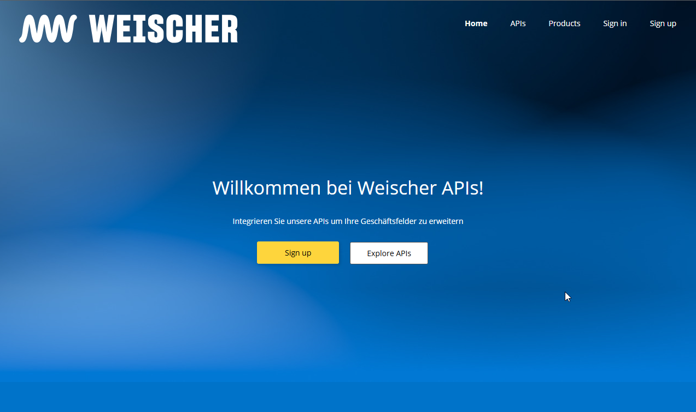

# Api Gateway

Das  [Weischer API Gateway](https://apim-jvb-we-prod.developer.azure-api.net/) stellt eine Übersicht über alle Endpunkte bereit sowie die zugehörige Schnittstellen-Dokumentation.

Wenn Du unsere APIs ausprobieren möchten, kannst Du dich oben rechts registrieren. Nach der Anmeldung kannst Du oben rechts den Menüpunkt „Products“ auswählen und über den Subscribe-Button registrierst Du dich für ein oder mehrere unserer API Produkte. Ein API Produkt bündelt mehrere APIs in einer Gruppe, die Du für einen bestimmten Business-Prozess benötigst.

Nachdem Du dich angemeldet hast erhalten wir automatisch eine Nachricht. Sobald unsere manuelle Überprüfung abgeschlossen ist, schalten wir Dich frei und Du erhältst einen API Key von unserem System per E-Mail. Diesen Key kannst Du dann zur Authentifizierung nutzen.