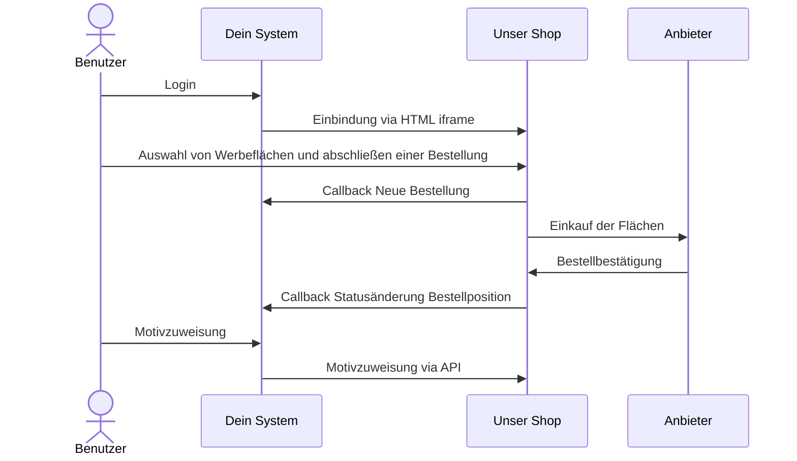
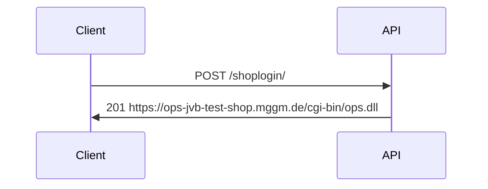
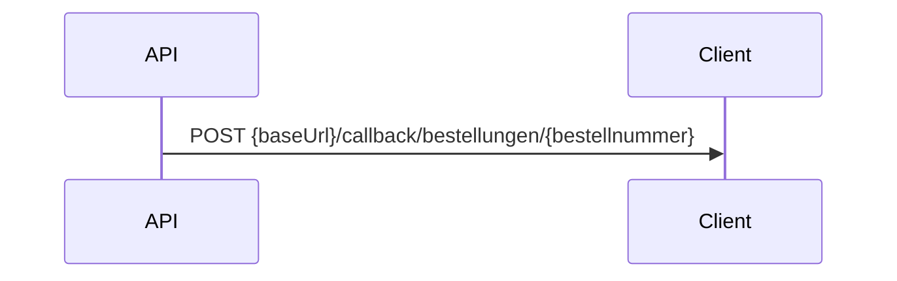

title: Iframe Shopintegration

Bei der IFrame Shopintegration hast du die Möglichkeit eine Shop-Oberfläche von uns via HTML iframe in deine Website zu integrieren.

Das nachfolgende Schaubild stellt beispielhaft den Bestellprozess dar.



## Händler anlegen

Um die Shop-Oberfläche nutzen zu können, ist es erforderlich das die Händler mit den nötigen Händlerdaten bei uns im System hinterlegt sind. Das kann im Vorfeld von uns durch einen Datenimport erfolgen oder über unsere Händler API. Mit 'Händler' sind alle Benutzer oder Filialen / Endkunden gemeint, die über deine Website unsere Shop-Oberfläche nutzen wollen.

Eines der wichtigsten Datenfelder des Händlers ist ```haendlerIdClient```. Dieses Feld ist eine eindeutige Nummer oder ein technischer Schlüssel, welcher den Benutzer / Endkunden in deinem System eindeutig identifiziert.

Um die Händler in unserem System anzulegen, kannst du folgende APIs verwenden:

[Händler anlegen]([https://](https://apim-jvb-we-prod.developer.azure-api.net/api-details#api=v0&operation=ops-shop-api-v0))

[Händler ändern]([https://](https://apim-jvb-we-prod.developer.azure-api.net/api-details#api=v0&operation=65e6ce5ae271b43a7fb63a5d))


## Shop Login

Damit du deine Benutzer / Händler auf unsere Shop-Oberfläche weiterleiten kannst, musst du zunächst einen Login durchführen. Um einen Login durchführen zu können, musst du die /shoplogin API verwenden und eine ```haendlerIdClient``` übergeben. Sofern der Aufruf erfolgreich ist, erhältst du eine URL zurück, welche du in einen HTML iframe auf deiner Website integrieren kannst.

## Shop Login



Die zurückgegebene URL kann für einen HTML iframe verwendet werden.

## Bestellung durchführen


- Der Benutzer wählt über die Shop-Oberfläche freie Flächen und Termine
- Innerhalb der Shop-Oberfläche bestätigt der Benutzer seinen Warenkorb
- Durch die Bestätigung des Warenkorbs wird eine Bestellung ausgelöst und der Warenkorb geleert für die nächste Bestellung
- Der Benutzer bleibt in der Shop-Oberfläche, sofern er diese nicht selbstständig verlässt


## Motive

Unsere Shop-Oberfläche kann so konfiguriert werden, das deine Benutzer direkt die Motive auswählen können die du uns zuvor bereitgestellt hast. Alternativ kannst du uns die Motive auch zu einem späterem Zeitpunkt via [Motiv API]([https://](https://apim-jvb-we-prod.developer.azure-api.net/api-details#api=order-api&operation=patch-bestellung)) übermitteln.

:warning: Bitte sprich im Projekt mit uns über Fristen, die  gegenüber Anbietern und Klebern eingehalten werden müssen.

## Callbacks

Für bestimmte Ereignisse kann dein System von uns informiert werden. Dazu ist es erforderlich, das dein System einige REST API Endpunkte zur Verfügung stellt. Diese werden dann von unserem System aufgerufen, sobald das Ereignis eintritt. Ganz typische Ereignisse sind zum Beispiel Callbacks für neue getätigte Bestellungen oder geänderte Status an Bestellpositionen.

### Authentifizierung an deinem System

Um die Callbacks abzusichern unterstützen wir OAUTH. Bevor ein Callback ausgelöst wird, holt sich unser System von deinem System einen gültigen Token. Dazu muss dein System einen entsprechenden Endpunkt bereitstellen:

```POST {baseUrl}/callback/login```

Wir übermitteln dann die mit dir abgestimmten Zugangsdaten in folgendem Format:

```
Payload Body
{
   "client_id": "weischer",
   "client_secret": "geheim",
   "grant_type": "client_credentials"
}
```

Unser System erwartet als Antwort einen gültigen OAUTH Bearer Token:

```
{
    "access_token": "{token}",
}
```

Dieser Token wird für alle Callbacks verwendet.

### Callback für Bestellungen

Abgeschlossene Bestellungen können an dein System zurück übermittelt werden. Dazu muss dein System folgenden Callback von unserem System entgegen nehmen können:



Dein System erhält die Bestellung in folgendem Format:

```
{
"flaechenbuchungen": [
    {
    "flaechenbuchungsID": 23456,
    "flaechenbuchungsIDClient": "10000009",
    "anbieterNr": 222,
    "standortNr": 365968471,
    "flNr": 1,
    "termin": 26,
    "jahr": 2025,
    "termin": 28,
    "motivID": 34567,
    "ersatzFlaeche": false,
    "tarif": 0,
    "technischeKosten": null,
    "festpreis": 0,
    "brutto": 180,
    "rabatt": 25,
    "netto1": 135,
    "buchungsstatus": 1,
    "ausfallgrund": null
    }
]
```

Solltest du weitere Daten zu den einzelnen Buchungen benötigen, kannst du unsere [Stammdaten-API](https://apim-jvb-we-prod.developer.azure-api.net/api-details#api=weischer-stammdaten-api-v3&operation=get-api-v3-grossflaechen-search-uid-uid-geschaeftsjahr-geschaeftsjahr) verwenden. Nutze dazu die Rückgabewerte ```anbieterNr```, ```standortNr``` und ```flNr``` um die uid zu bilden.

### Callback für Statusänderungen

Sobald sich der Bestellstatus einer Bestellpositionen ändert (z. B. Anbieter bestätigt oder storniert Flächenbuchung), kann diese Änderung an dein System zurück übermittelt werden.

Dazu muss dein System folgenden Callback von unserem System entgegennehmen können:

__Bestätigung:__
```PATCH {baseUrl}/callback/bestellungen/{bestellnummer}/{flaechenNummer}/confirmed```


__Storno:__
```PATCH {baseUrl}/callback/bestellungen/{bestellnummer}/{flaechenNummer}/canceled```